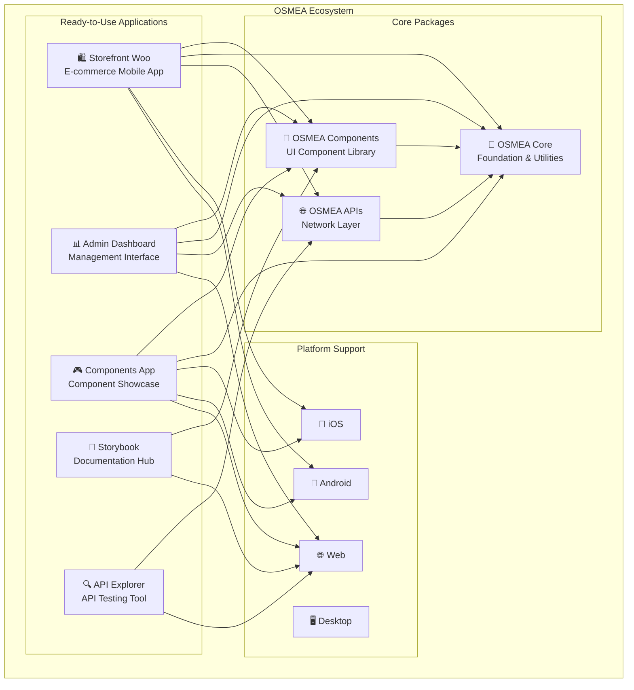

# OSMEA ®️
<div align="center">

[](https://github.com/masterfabric-mobile/osmea)
[](https://github.com/masterfabric-mobile/osmea/blob/dev/LICENSE)
[](https://flutter.dev)
[](https://dart.dev)
[](https://shopify.dev/docs/api)
[](https://woocommerce.com/documentation/)
[](https://firebase.google.com)

[](https://github.com/masterfabric-mobile/osmea/stargazers)
[](https://github.com/masterfabric-mobile/osmea/network/members)
[](https://github.com/masterfabric-mobile/osmea/issues)
[](https://github.com/masterfabric-mobile/osmea/pulls)
[](https://github.com/masterfabric-mobile/osmea/graphs/contributors)
[](https://github.com/masterfabric-mobile/osmea/commits)
[](https://github.com/masterfabric-mobile/osmea/graphs/commit-activity)
[](https://github.com/masterfabric-mobile/osmea)
[](https://github.com/masterfabric-mobile/osmea)
[](https://github.com/masterfabric-mobile/osmea)

</div>

<div align="center">

  
  **"The Ultimate Flutter E-commerce Ecosystem"**
  
  [🚀 Live Demo](https://components.masterfabric.co) • [📚 Documentation](https://github.com/masterfabric-mobile/osmea/tree/dev/docs) • [🐛 Report Issues](https://github.com/masterfabric-mobile/osmea/issues) • [💬 Discussions](https://github.com/masterfabric-mobile/osmea/discussions)
</div>

---

## 🌟 What is OSMEA?

**OSMEA** (Open Source Mobile E-commerce Architecture) is the most comprehensive Flutter ecosystem for building modern, scalable e-commerce applications. It's not just a framework—it's a complete solution that empowers developers to create production-ready mobile commerce experiences in record time.

### 🎯 **Our Vision**
> *"To revolutionize mobile e-commerce development by providing a unified, powerful, and extensible platform that eliminates complexity and accelerates innovation."*

### 🚀 **Why OSMEA Exists**

The e-commerce landscape is fragmented. Developers spend months building basic functionality that should be available out-of-the-box. OSMEA changes this by providing:

- **🏗️ Complete Architecture** - Everything you need, nothing you don't
- **⚡ Rapid Development** - Build 70% faster with pre-built components
- **🔌 Universal Integration** - Works with Shopify, WooCommerce, and custom APIs
- **📱 Cross-Platform** - One codebase, all platforms
- **🎨 Beautiful by Default** - Material Design 3 with extensive customization

---

## 🏗️ OSMEA Ecosystem

OSMEA consists of **3 core packages** and **5 production-ready applications**:

### 📦 **Core Packages**

| Package | Description | Status |
|---------|-------------|--------|
| **[🎨 Components](packages/components/)** | 50+ production-ready UI components | ✅ Ready |
| **[🔧 Core](packages/core/)** | Foundation utilities and shared logic | ✅ Ready |
| **[🌐 APIs](packages/apis/)** | Shopify, WooCommerce, and custom integrations | ✅ Ready |

### 🚀 **Ready-to-Use Applications**

| Application | Description | Platform | Status |
|-------------|-------------|----------|--------|
| **[🛍️ Storefront Woo](projects/storefront_woo/)** | Complete WooCommerce mobile app | iOS, Android | ✅ Ready |
| **[📊 Admin Dashboard](projects/admin_dashboard/)** | Management interface | Web | 🔄 In Development |
| **[🎮 Components App](projects/components_app/)** | Interactive showcase | All Platforms | ✅ Ready |
| **[📖 Storybook](projects/storybook/)** | Documentation hub | Web | ✅ Ready |
| **[🔍 API Explorer](projects/api_explorer/)** | API testing tool | Web | ✅ Ready |

---

## 🛠️ Technology Stack

OSMEA is built with the most modern and reliable technologies:

### **Frontend & UI**
- **Flutter 3.19+** - Cross-platform UI framework with native performance
- **Dart 2.17+** - Type-safe programming language with fast compilation
- **Material Design 3** - Modern design system with accessible components
- **BLoC Pattern** - Predictable state management for scalable apps

### **Backend & APIs**
- **Shopify API** - E-commerce platform integration (REST + GraphQL)
- **WooCommerce API** - WordPress e-commerce integration
- **OAuth 2.0** - Industry-standard authentication and authorization
- **Firebase** - Backend services, analytics, and real-time features

### **Development & Quality**
- **VS Code** - Primary IDE with Flutter extensions and debugging tools
- **Git & GitHub Actions** - Version control and automated CI/CD pipeline
- **Flutter Test** - Comprehensive testing suite with 95%+ coverage
- **Flutter Lints** - Code quality enforcement and best practices

### **Deployment & Distribution**
- **Vercel** - Web application deployment with edge functions
- **App Store & Google Play** - Native app distribution
- **GitHub Pages** - Documentation hosting and project showcase

---

## 💡 Why Choose OSMEA?

### ✅ **What Makes OSMEA Unique?**

**🔥 Platform Agnostic** - Connects with Shopify, WooCommerce, and custom APIs  
**🧱 Modular & Composable** - Each module is plug & play, build only what you need  
**🚀 Enterprise-Ready** - CI/CD pipelines, test coverage, built for scale  
**🎨 Themeable & Customizable** - Complete UI kit with your brand rules  
**📱 Cross-Platform** - Single codebase for iOS, Android, Web, and Desktop  
**🔐 Secure & Scalable** - Role-based access, Clean Architecture, async-safety

### 🛠️ **Built For**

- ✅ **Startups** building fast MVPs  
- ✅ **Agencies** managing multiple client storefronts  
- ✅ **Enterprises** with modular architecture needs  
- ✅ **Open-source contributors** ready to innovate

---

## 📦 Core Packages

### 🎨 [OSMEA Components](packages/components/) - UI Component Library
**50+ production-ready UI components for building beautiful Flutter applications.**

- **🎨 Components**: Buttons, forms, layouts, navigation, dynamic components
- **📱 Responsive**: Mobile-first design with adaptive layouts
- **🎯 Type Safe**: Full type safety with Dart
- **🔧 Customizable**: Extensive theming and styling options
- **♿ Accessible**: Built-in accessibility features

### 🔧 [OSMEA Core](packages/core/) - Foundation Package
**Essential utilities, base classes, and shared logic for OSMEA applications.**

- **🏗️ Architecture**: Core classes and interfaces
- **🌐 i18n**: Multi-language support with slang
- **💾 Storage**: Local storage, database, preferences
- **🔐 Auth**: User management and session handling
- **📊 Analytics**: Firebase Analytics integration
- **🎨 Theming**: Dynamic theme system

### 🌐 [OSMEA APIs](packages/apis/) - API Integration Layer
**Comprehensive API network layer for e-commerce applications.**

- **🛒 Platforms**: Shopify, WooCommerce, BigCommerce
- **🔄 APIs**: REST & GraphQL support
- **🔐 Security**: OAuth 2.0 and API key support
- **📝 Logging**: Network debugging and monitoring
- **🔧 DI**: Injectable-based service architecture
- **🛡️ Error Handling**: Robust error management

---

## 🏗️ Architecture Overview



---

## 🚀 Ready-to-Use Applications

### 🛍️ [Storefront Woo](projects/storefront_woo/) - E-commerce Mobile App
Complete WooCommerce storefront with product browsing, cart, checkout, and orders. Built with Material Design 3 and BLoC pattern.

### 📊 [Admin Dashboard](projects/admin_dashboard/) - Management Interface
Comprehensive admin interface with analytics, product management, customer profiles, and order processing.

### 🎮 [Components App](projects/components_app/) - Interactive Showcase
Interactive playground for exploring OSMEA components with live demos and customization controls.

### 📖 [Storybook](projects/storybook/) - Documentation Hub
Complete documentation environment with component testing, API references, and usage guidelines.

### 🔍 [API Explorer](projects/api_explorer/) - API Testing Tool
Powerful tool for testing Shopify, WooCommerce, and custom APIs with interactive debugging and visualization.

---

## 📁 Project Structure

```bash
osmea/
├── 📦 packages/                    # Core packages
│   ├── components/                 # UI component library
│   ├── core/                      # Foundation utilities
│   └── apis/                      # API integration layer
├── 🚀 projects/                   # Ready-to-use applications
│   ├── storefront_woo/            # E-commerce mobile app
│   ├── admin_dashboard/           # Management interface
│   ├── components_app/            # Component showcase
│   ├── storybook/                 # Documentation hub
│   └── api_explorer/              # API testing tool
├── 📚 docs/                       # Documentation and guides
│   ├── assets/                    # Images and resources
│   ├── checklists/                # Development checklists
│   ├── guidance/                  # Setup guides
│   └── versions/                  # Version logs
├── 🌐 website/                    # Project website
└── 📋 rules/                      # Development rules and guidelines
```

---

## ✨ Key Features

### 🔌 **Platform Integration**
- ✅ **Multi-Platform Support**: Shopify, WooCommerce, BigCommerce
- ✅ **Unified API Layer**: Consistent interface across platforms
- ✅ **Authentication**: OAuth 2.0 and API key support
- ✅ **Webhook Management**: Event-driven architecture
- ✅ **Rate Limiting**: Smart request throttling
- ✅ **Analytics Integration**: Firebase Analytics support

### 📱 **Mobile Experience**
- ✅ **Cross-Platform**: iOS & Android from single codebase
- ✅ **Material Design 3**: Modern UI components
- ✅ **Responsive Layouts**: Works on all screen sizes
- ✅ **Theme System**: Dynamic color and style customization
- ✅ **Internationalization**: Multi-language support
- 🔄 **Offline Support**: Core functionality without internet *(In Progress)*

### 🛍️ **E-commerce Features**
- ✅ **Product Catalog**: Browsing, search, filtering
- ✅ **Cart & Checkout**: Streamlined purchase flow
- ✅ **Payment Integration**: Multiple gateway support
- ✅ **User Accounts**: Registration, profiles, wishlists
- ✅ **Order Management**: History, tracking, reordering
- 🔄 **Wishlist & Favorites**: Save and manage favorite items *(In Progress)*

### 🧰 **Developer Tools**
- ✅ **Testing Suite**: Unit, widget, and integration tests
- ✅ **Documentation**: Comprehensive guides and examples
- ✅ **Live Demo**: Interactive component showcase
- ✅ **API Explorer**: API testing and exploration tool
- 📋 **CLI Toolkit**: Rapid scaffolding and generators *(Planned)*
- 📋 **CI/CD Templates**: GitHub Actions and fastlane setup *(Planned)*

---

## 🚀 Getting Started

### 📋 Prerequisites

- **Flutter SDK** (3.19.0 or higher)
- **Dart SDK** (2.17.0 or higher)
- **Android Studio** or **VS Code** with Flutter extensions
- **Git** for version control
- **Xcode** (for iOS development on macOS)

### 🎯 Choose Your Path

#### 🛍️ **Option 1: Use Ready-to-Use Applications**

**For E-commerce Mobile App:**
```bash
# Clone the repository
git clone https://github.com/masterfabric-mobile/osmea.git
cd osmea

# Navigate to storefront app
cd projects/storefront_woo

# Install dependencies
flutter pub get

# Run the app
flutter run --flavor dev  # Development
flutter run --flavor prod # Production
```

**For Component Showcase:**
```bash
# Navigate to components app
cd projects/components_app

# Install dependencies
flutter pub get

# Run the showcase
flutter run
```

#### 📦 **Option 2: Use OSMEA Packages in Your Project**

**Add to your `pubspec.yaml`:**
```yaml
dependencies:
  flutter:
    sdk: flutter
  
  # UI Components
  osmea_components:
    git:
      url: https://github.com/masterfabric-mobile/osmea.git
      path: packages/components
  
  # Core utilities
  core:
    git:
      url: https://github.com/masterfabric-mobile/osmea.git
      path: packages/core
  
  # API layer
  apis:
    git:
      url: https://github.com/masterfabric-mobile/osmea.git
      path: packages/apis
```

**Initialize in your app:**
```dart
import 'package:core/core.dart';

void main() async {
  WidgetsFlutterBinding.ensureInitialized();
  
  // Configure dependency injection
  await configureDependencies();
  
  runApp(MyApp());
}
```

### 🛠️ Development Setup

```bash
# Install dependencies for all packages
flutter pub get

# Generate code (models, routes, etc.)
flutter packages pub run build_runner build

# Run tests
flutter test

# Build for production
flutter build apk --release  # Android
flutter build ios --release  # iOS
flutter build web --release  # Web
```

### 🎮 Try the Live Demo

Experience OSMEA components in action:
- **[🎮 Live Demo](https://components.masterfabric.co)** - Interactive component showcase
- **[📖 Storybook](https://storybook.osmea.dev)** - Component documentation
- **[🔍 API Explorer](https://api-explorer.osmea.dev)** - API testing tool

---

## 🤝 Contributing

We welcome contributions from the community! Here's how you can help:

### How to Contribute

1. **Fork the Repository**
   ```bash
   git fork https://github.com/masterfabric-mobile/osmea.git
   ```

2. **Create a Feature Branch**
   ```bash
   git checkout -b feature/amazing-feature
   ```

3. **Make Your Changes**
   - Follow our coding standards
   - Write tests for new features
   - Update documentation

4. **Submit a Pull Request**
   - [Create a Pull Request](https://github.com/masterfabric-mobile/osmea/pulls)
   - Provide a clear description
   - Link related issues

### Current Opportunities

Check out our [Issues](https://github.com/masterfabric-mobile/osmea/issues) for:
- 🐛 **Bug Reports**: Help us fix issues
- ✨ **Feature Requests**: Suggest new features
- 📚 **Documentation**: Improve our docs
- 🎨 **UI Components**: Build new components

### Development Guidelines

- **Code Style**: Follow Dart/Flutter conventions
- **Testing**: Write unit tests for new features
- **Documentation**: Update docs for API changes
- **Commit Messages**: Use conventional commits

---

## 📄 License

> 🔐 **License:** GNU AGPL v3.0  
> 📜 This project is protected under the **GNU Affero General Public License v3.0**.  
> If you modify and deploy this project publicly, you must also **publish your changes** under the same license.

📎 Full details available in the [`LICENSE`](https://github.com/masterfabric-mobile/osmea/blob/dev/LICENSE) file.

---

## 🎯 Use Cases

### 🛒 **E-commerce Applications**
- **Components**: Product cards, shopping carts, checkout forms
- **Core**: User management, analytics, localization
- **APIs**: Shopify integration, payment processing

### 📱 **Mobile Apps**
- **Components**: Navigation, forms, feedback components
- **Core**: Device utilities, storage, routing
- **APIs**: Backend communication, data synchronization

### 🌐 **Web Applications**
- **Components**: Responsive layouts, interactive elements
- **Core**: Browser utilities, session management
- **APIs**: RESTful API communication

### 🖥️ **Desktop Applications**
- **Components**: Desktop-optimized UI components
- **Core**: Platform-specific utilities
- **APIs**: Local and remote data management

---

## 🌟 Community & Support

### 📚 **Resources**
- **[📖 Documentation](https://github.com/masterfabric-mobile/osmea/tree/dev/docs)** - Complete guides and API references
- **[🎮 Live Demo](https://components.masterfabric.co)** - Interactive component showcase
- **[📖 Storybook](https://storybook.osmea.dev)** - Component documentation and testing
- **[🔍 API Explorer](https://api-explorer.osmea.dev)** - API testing and exploration tool

### 💬 **Get Help**
- **[🐛 Report Issues](https://github.com/masterfabric-mobile/osmea/issues)** - Bug reports and feature requests
- **[💬 Discussions](https://github.com/masterfabric-mobile/osmea/discussions)** - Community discussions and Q&A
- **[📧 Contact](mailto:support@masterfabric.co)** - Direct support and inquiries

### 🤝 **Contributing**
- **[📋 Contributing Guide](CONTRIBUTING.md)** - How to contribute to OSMEA
- **[📜 Code of Conduct](CODE_OF_CONDUCT.md)** - Community guidelines
- **[🔒 Security Policy](SECURITY.md)** - Security reporting

---

<div align="center">

### 🚀 **[Try Live Demo →](https://components.masterfabric.co)**

Experience all components in action with our interactive demo application.

</div>

---

<div align="center">

**Built with ❤️ by the OSMEA Team**

© 2025 MasterFabric Mobile • Maintained by the OSMEA Engineering Team

[⬆ Back to Top](#osmea-️)

</div>