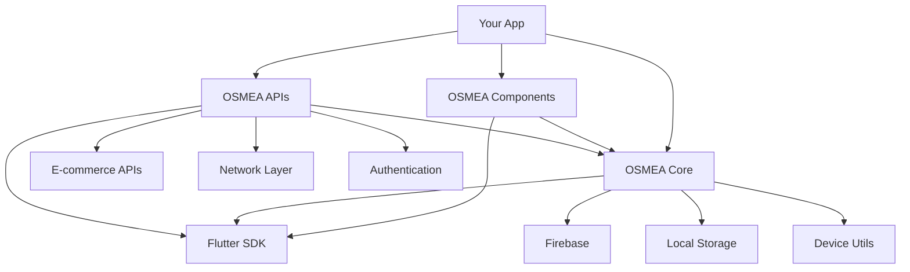

# 📦 OSMEA Packages

<div align="center">

[](https://github.com/masterfabric-mobile/osmea)
[](https://flutter.dev)
[](https://dart.dev)
[](https://github.com/masterfabric-mobile/osmea/tree/dev/packages)
[](https://github.com/masterfabric-mobile/osmea/stargazers)
[](https://github.com/masterfabric-mobile/osmea/network/members)

</div>

<div align="center">

**"The Complete Flutter Ecosystem for Modern Applications"**

[🚀 Get Started](https://github.com/masterfabric-mobile/osmea#readme) • [📚 Documentation](https://github.com/masterfabric-mobile/osmea/tree/dev/docs) • [🐛 Report Issues](https://github.com/masterfabric-mobile/osmea/issues) • [💬 Discussions](https://github.com/masterfabric-mobile/osmea/discussions)

</div>

---

## 📋 Table of Contents

- [🌟 Overview](#-overview)
- [📦 Available Packages](#-available-packages)
  - [🎨 OSMEA Components](#-osmea-components)
  - [🔧 OSMEA Core](#-osmea-core)
  - [🌐 OSMEA APIs](#-osmea-apis)
- [🏗️ Architecture Overview](#️-architecture-overview)
- [🚀 Getting Started](#-getting-started)
- [🎯 Use Cases](#-use-cases)
- [🔧 Development](#-development)
- [📚 Documentation](#-documentation)
- [🤝 Contributing](#-contributing)
- [📄 License](#-license)

---

## 🌟 Overview

The **OSMEA Packages** is a comprehensive, modular Flutter ecosystem designed to provide developers with a complete toolkit for building modern, scalable, and production-ready applications. Each package is carefully crafted to work seamlessly together while maintaining independence and flexibility.

### 🎯 **Ecosystem Vision**
> *"To provide a unified, powerful, and extensible Flutter ecosystem that accelerates development while maintaining the highest standards of code quality and user experience."*

### 🚀 **Why OSMEA Packages?**

Building modern Flutter applications requires multiple layers of functionality - UI components, core utilities, API integration, state management, and more. OSMEA Packages eliminates this complexity by providing:

- **🔌 Unified Ecosystem** - All packages work together seamlessly
- **⚡ Zero Configuration** - Get started in minutes, not hours
- **🛡️ Production Ready** - Battle-tested in real-world applications
- **🔧 Developer Experience** - Intuitive APIs and comprehensive documentation
- **📱 Cross-Platform** - Full support for iOS, Android, Web, and Desktop

### 🎨 **Design Philosophy**

- **🔄 Modular Architecture** - Each package is self-contained and can be used independently
- **⚡ Performance First** - Optimized for speed and efficiency
- **🎨 Design System** - Consistent UI/UX across all components
- **🔧 Developer Experience** - Intuitive APIs and comprehensive documentation
- **📱 Cross-Platform** - Full support for iOS, Android, Web, and Desktop
- **🛡️ Type Safety** - Full TypeScript-like type safety with Dart
- **🧪 Testable** - Built with testing in mind from the ground up

---

## 📦 Available Packages

### 🎨 [OSMEA Components](packages/components/)

<div align="center">

[](packages/components/)
[](packages/components/pubspec.yaml)
[](packages/components/)
[](https://osmea-app.web.app)

</div>

**A comprehensive UI component library for building beautiful, accessible Flutter applications with modern design patterns and responsive layouts.**

#### 🎯 **Package Vision**
> *"To provide a complete UI toolkit that enables developers to build stunning, consistent, and accessible user interfaces with minimal effort and maximum flexibility."*

#### ✨ **Key Features**
- **🎨 50+ UI Components** - Buttons, forms, layouts, navigation, dynamic, and more
- **📱 Responsive Design** - Mobile-first approach with adaptive layouts
- **🎯 Type Safety** - Full TypeScript-like type safety with Dart
- **🔧 Customization** - Extensive theming and styling options
- **♿ Accessibility** - Built-in accessibility support and ARIA compliance
- **🌐 Internationalization** - Multi-language support and RTL layouts
- **📏 Size Extensions** - `.w` and `.h` extensions for responsive sizing

#### 📋 **Component Categories**

| Category | Components | Description |
|----------|------------|-------------|
| **🎨 Basic** | Buttons, Text, Badges, Avatars, Cards, Chips | Essential UI building blocks |
| **📝 Forms** | Input fields, Checkboxes, Radio buttons, Switches, Dropdowns | User input and data collection |
| **📐 Layout** | Containers, Grid system, Spacing, Alignment, Flexible layouts | Structure and positioning |
| **🧭 Navigation** | App bars, Navigation bars, Tab bars, Bottom sheets | App navigation and routing |
| **⚡ Dynamic** | Loading indicators, Toast notifications, Progress bars | Interactive feedback |
| **🚀 Advanced** | Carousels, Search bars, Rich text, Color pickers | Complex interactive elements |

#### 🛠️ **Technology Stack**
- **Flutter 3.19+** - Latest Flutter framework
- **Dart 2.17+** - Type-safe programming language
- **Material Design 3** - Modern design system
- **Responsive Design** - Adaptive layouts for all screen sizes
- **Accessibility** - WCAG 2.1 compliance

#### 🚀 **Quick Start**
```yaml
dependencies:
  osmea_components:
    git:
      url: https://github.com/masterfabric-mobile/osmea.git
      ref: dev
      path: packages/components
```

#### 💡 **Usage Example**
```dart
import 'package:osmea_components/osmea_components.dart';

// Basic button with size extensions
OsmeaComponents.button(
  text: 'Click Me',
  variant: ButtonVariant.primary,
  width: 200.w,  // Responsive width
  height: 48.h,  // Responsive height
  onPressed: () {
    // Handle button press
  },
)

// Responsive container with spacing
OsmeaComponents.container(
  padding: 16.w,  // Width-based padding
  margin: 8.h,    // Height-based margin
  child: OsmeaComponents.text('Hello World'),
)
```

#### 📚 **Learn More**
- **[📖 Full Documentation](packages/components/README.md)** - Complete component reference
- **[🎮 Live Demo](https://osmea-app.web.app)** - Interactive playground
- **[📱 Example App](packages/components/example_mobile/)** - Real-world implementation
- **[🎨 Storybook](packages/components/example_storybook/)** - Component showcase

---

### 🔧 [OSMEA Core](packages/core/)

<div align="center">

[](packages/core/)
[](packages/core/pubspec.yaml)
[](packages/core/)
[](https://firebase.google.com)

</div>

**The foundation package providing essential utilities, base classes, and shared logic for OSMEA applications with comprehensive helper functions and Firebase integration.**

#### 🎯 **Package Vision**
> *"To provide a robust, modular, and extensible core foundation that simplifies complex application logic and promotes best practices in Flutter development."*

#### ✨ **Key Features**
- **🏗️ Base Architecture** - Core classes and interfaces for consistent app structure
- **🌐 Internationalization** - Multi-language support with slang
- **💾 Data Management** - Local storage, database, and preferences
- **📊 Analytics** - Firebase analytics integration
- **🔧 Dependency Injection** - Injectable-based DI system
- **📱 Device Information** - Platform-specific utilities and device info
- **🛣️ Routing** - GoRouter-based navigation system
- **📝 Logging** - Structured logging with different levels
- **🛠️ 15+ Helpers** - Comprehensive utility functions for common tasks

#### 📋 **Core Modules**

| Module | Description | Key Features |
|--------|-------------|--------------|
| **🏗️ Base Architecture** | BaseViewBloc, BaseViewCubit, MasterView, MasterApp | Consistent app structure, lifecycle management |
| **🌐 Internationalization** | Multi-language support with slang | Dynamic language switching, asset-based translations |
| **💾 Data Management** | Local storage, database, and preferences | SQLite, SharedPreferences, encryption support |
| **📊 Analytics** | Firebase analytics integration | Event tracking, user behavior analysis |
| **🔧 Dependency Injection** | Injectable-based DI system | Service locator, modular DI configuration |
| **📱 Device Information** | Platform-specific utilities and device info | Device detection, capabilities, permissions |
| **🛣️ Routing** | GoRouter-based navigation system | Declarative routing, navigation handling |
| **📝 Logging** | Structured logging with different levels | Debug, info, warning, error levels |

#### 🛠️ **Helper Functions**

| Helper | Purpose | Key Features |
|--------|---------|--------------|
| **📱 DeviceInfoHelper** | Device information and capabilities | Model, OS, Platform, Device ID detection |
| **🔐 PermissionHelper** | Runtime permission management | Status checking, batch requests, rationale |
| **🌐 UrlLauncherHelper** | External link and app launching | URL, email, phone, SMS launching |
| **📤 FileSharingHelper** | Cross-platform content sharing | Text, file, image sharing with compression |
| **🔔 LocalNotificationHelper** | Local notification management | Immediate, scheduled, notification management |
| **💾 StorageHelper** | Local storage management | Encryption, multiple data types, complex objects |
| **🌐 NetworkHelper** | Network connectivity and status | Real-time monitoring, connection type detection |
| **✅ ValidationHelper** | Input validation utilities | Email, phone, password, credit card validation |
| **🎨 FormatHelper** | Text and data formatting | Currency, date, phone, file size formatting |
| **🎨 ThemeHelper** | Theme and styling utilities | Colors, text styles, responsive design |
| **📅 DateHelper** | Date and time utilities | Relative time, timezone handling, comparisons |
| **⚙️ AssetConfigHelper** | Load app configuration from assets | Type-safe access, validation, environment support |
| **🔍 SearchHelper** | Search and filtering utilities | Text search, filtering, sorting algorithms |
| **📊 AnalyticsHelper** | Analytics and tracking utilities | Event tracking, user behavior analysis |
| **🔐 SecurityHelper** | Security and encryption utilities | Data encryption, secure storage, key management |

#### 🛠️ **Technology Stack**
- **Flutter 3.19+** - Latest Flutter framework
- **Dart 2.17+** - Type-safe programming language
- **BLoC Pattern** - State management with Cubit and BLoC
- **GetIt & Injectable** - Dependency injection and service location
- **Slang** - Internationalization and localization
- **Firebase Core** - Essential Firebase services
- **Firebase Analytics** - User behavior tracking
- **Firebase Remote Config** - Dynamic configuration
- **SQFlite** - Local database storage
- **Shared Preferences** - Lightweight key-value storage

#### 🚀 **Quick Start**
```yaml
dependencies:
  osmea_core:
    git:
      url: https://github.com/masterfabric-mobile/osmea.git
      ref: dev
      path: packages/core
```

#### 💡 **Usage Example**
```dart
import 'package:osmea_core/osmea_core.dart';

// Initialize core services
void main() async {
  WidgetsFlutterBinding.ensureInitialized();
  await configureDependencies();
  await initTranslations();
  runApp(MyApp());
}

// Use helpers
final deviceInfo = DeviceInfoHelper();
final info = await deviceInfo.getDeviceInfo();
print('Device: ${info.model}');

// Use base view
class MyView extends BaseViewBloc<MyCubit, MyState> {
  @override
  Widget buildView(BuildContext context) {
    return Scaffold(
      body: BlocBuilder<MyCubit, MyState>(
        builder: (context, state) {
          return state.when(
            loading: () => CircularProgressIndicator(),
            success: (data) => Text('Data: $data'),
            error: (error) => Text('Error: $error'),
          );
        },
      ),
    );
  }
}
```

#### 📚 **Learn More**
- **[📖 Full Documentation](packages/core/README.md)** - Complete core utilities guide
- **[🔧 Example App](packages/core/example/)** - Implementation examples
- **[🌐 i18n Setup](packages/core/assets/i18n/)** - Localization examples
- **[🛠️ Helper Guide](packages/core/README.md#-detailed-helper-documentation)** - Detailed helper documentation

---

### 🌐 [OSMEA APIs](packages/apis/)

<div align="center">

[](packages/apis/)
[](packages/apis/pubspec.yaml)
[](https://pub.dev/packages/dio)
[](https://restfulapi.net)
[](https://graphql.org)

</div>

**A robust network layer for handling RESTful API requests and responses with comprehensive e-commerce platform integration and advanced networking features.**

#### 🎯 **Package Vision**
> *"To simplify API integration complexity and provide a unified, powerful, and extensible network layer that accelerates Flutter development."*

#### ✨ **Key Features**
- **🛒 E-commerce Integration** - Complete Shopify, WooCommerce, BigCommerce support
- **🌐 RESTful APIs** - Standardized API communication patterns
- **🔄 Retry Logic** - Automatic retry mechanisms for failed requests
- **🍪 Cookie Management** - Session and authentication handling
- **📝 Request/Response Logging** - Comprehensive network debugging
- **🔧 Dependency Injection** - Injectable-based service architecture
- **📦 Code Generation** - Freezed and JSON serialization
- **🛡️ Error Handling** - Robust error management and recovery
- **⚡ Performance** - Optimized for speed and efficiency

#### 📋 **API Modules**

| Module | Description | Key Features |
|--------|-------------|--------------|
| **🛒 E-commerce APIs** | Shopify, WooCommerce, BigCommerce integration | Storefront, Admin, Customer APIs |
| **🌐 RESTful APIs** | Standardized API communication | HTTP methods, status codes, headers |
| **🔐 Authentication** | OAuth and session management | Token refresh, secure storage |
| **📁 File Management** | Upload and download utilities | Image, document, media handling |
| **💾 Caching** | Request caching and optimization | Memory, disk, network caching |
| **🔧 Interceptors** | Request/response modification | Logging, authentication, error handling |
| **🛡️ Error Handling** | Standardized error responses | Custom exceptions, retry logic |
| **📊 Monitoring** | Network performance tracking | Metrics, analytics, debugging |

#### 🛠️ **Technology Stack**
- **Dart 2.17+** - Type-safe programming language
- **Dio 5.0+** - Powerful HTTP client for Dart
- **GetIt 7.0+** - Service locator and dependency injection
- **Injectable 2.0+** - Code generation for dependency injection
- **Logger 2.0+** - Flexible logging utility
- **Freezed** - Code generation for data classes
- **JSON Annotation** - JSON serialization support

#### 🚀 **Quick Start**
```yaml
dependencies:
  osmea_apis:
    git:
      url: https://github.com/masterfabric-mobile/osmea.git
      ref: dev
      path: packages/apis
```

#### 💡 **Usage Example**
```dart
import 'package:osmea_apis/osmea_apis.dart';
import 'package:get_it/get_it.dart';

// Configure dependency injection
@InjectableInit()
Future<void> configureDependencies() async => getIt.init();

// Use API service
final apiService = GetIt.instance<ShopifyApiService>();

// Make API calls
Future<void> fetchProducts() async {
  try {
    final products = await apiService.getProducts();
    print('Products: ${products.length}');
  } catch (e) {
    print('Error: $e');
  }
}

// Use with error handling
Future<void> createOrder(OrderData orderData) async {
  try {
    final order = await apiService.createOrder(orderData);
    print('Order created: ${order.id}');
  } on ApiException catch (e) {
    print('API Error: ${e.message}');
  } on NetworkException catch (e) {
    print('Network Error: ${e.message}');
  }
}
```

#### 📚 **Learn More**
- **[📖 Full Documentation](packages/apis/README.md)** - Complete API integration guide
- **[🔧 Example App](packages/apis/example/)** - API usage examples
- **[🛒 E-commerce APIs](packages/apis/lib/network/remote/)** - Available endpoints
- **[🌐 REST API Guide](packages/apis/README.md#-core-features)** - REST API documentation

---

## 🏗️ Architecture Overview

### 📊 **Package Dependencies**



### 🔄 **Integration Patterns**

#### **Complete Integration**
```dart
import 'package:osmea_components/osmea_components.dart';
import 'package:osmea_core/osmea_core.dart';
import 'package:osmea_apis/osmea_apis.dart';

void main() async {
  WidgetsFlutterBinding.ensureInitialized();
  
  // Initialize core services
  await configureDependencies();
  await initTranslations();
  
  // Start your app
  runApp(MyApp());
}
```

#### **Component Usage with Core Services**
```dart
// Use OSMEA components with core services
OsmeaComponents.button(
  text: 'Click Me',
  variant: ButtonVariant.primary,
  width: 200.w,  // Responsive sizing
  height: 48.h,  // Responsive sizing
  onPressed: () async {
    // Use core services
    final analytics = getIt<AnalyticsService>();
    analytics.trackEvent('button_clicked');
    
    // Use helpers
    final deviceInfo = getIt<DeviceInfoHelper>();
    final info = await deviceInfo.getDeviceInfo();
    
    // Make API calls
    final apiService = getIt<ShopifyApiService>();
    final products = await apiService.getProducts();
    
    // Show notification
    final notificationHelper = getIt<LocalNotificationHelper>();
    await notificationHelper.showNotification(
      title: 'Success',
      body: 'Products loaded successfully!',
    );
  },
)
```

#### **Base View with API Integration**
```dart
class ProductView extends BaseViewBloc<ProductCubit, ProductState> {
  @override
  Widget buildView(BuildContext context) {
    return Scaffold(
      appBar: OsmeaComponents.appBar(
        title: 'Products',
        actions: [
          OsmeaComponents.iconButton(
            icon: Icons.search,
            onPressed: () => _showSearch(),
          ),
        ],
      ),
      body: BlocBuilder<ProductCubit, ProductState>(
        builder: (context, state) {
          return state.when(
            loading: () => OsmeaComponents.loadingIndicator(),
            success: (products) => OsmeaComponents.gridView(
              itemCount: products.length,
              itemBuilder: (context, index) {
                final product = products[index];
                return OsmeaComponents.productCard(
                  product: product,
                  onTap: () => _navigateToProduct(product),
                );
              },
            ),
            error: (error) => OsmeaComponents.errorView(
              message: error,
              onRetry: () => cubit.loadProducts(),
            ),
          );
        },
      ),
    );
  }
}
```

---

## 🚀 Getting Started

### 📋 **Prerequisites**

- **Flutter SDK** (3.19.0 or higher)
- **Dart SDK** (2.17.0 or higher)
- **Git** for version control
- **VS Code** or **Android Studio** for development
- **Firebase Account** (optional, for analytics and remote config)

### 🔧 **Installation**

#### **1. Add Dependencies**

Add the packages you need to your `pubspec.yaml`:

```yaml
dependencies:
  flutter:
    sdk: flutter
  
  # UI Components
  osmea_components:
    git:
      url: https://github.com/masterfabric-mobile/osmea.git
      ref: dev
      path: packages/components
  
  # Core utilities
  osmea_core:
    git:
      url: https://github.com/masterfabric-mobile/osmea.git
      ref: dev
      path: packages/core
  
  # API layer
  osmea_apis:
    git:
      url: https://github.com/masterfabric-mobile/osmea.git
      ref: dev
      path: packages/apis
```

#### **2. Install Dependencies**
```bash
flutter pub get
```

#### **3. Generate Code**
```bash
# Generate code for all packages
flutter packages pub run build_runner build --delete-conflicting-outputs
```

#### **4. Initialize Services**
```dart
import 'package:osmea_core/osmea_core.dart';
import 'package:osmea_components/osmea_components.dart';
import 'package:osmea_apis/osmea_apis.dart';

void main() async {
  WidgetsFlutterBinding.ensureInitialized();
  
  // Configure dependency injection
  await configureDependencies();
  
  // Initialize translations
  await initTranslations();
  
  // Load app configuration
  await AssetConfigHelper.loadConfig();
  
  runApp(MyApp());
}
```

### 🎯 **Quick Start Examples**

#### **Basic App Setup**
```dart
class MyApp extends MasterApp {
  @override
  Widget build(BuildContext context) {
    return MasterView(
      title: 'My OSMEA App',
      theme: ThemeData.light(),
      routes: {
        '/': (context) => HomeView(),
        '/products': (context) => ProductsView(),
        '/profile': (context) => ProfileView(),
      },
      initialRoute: '/',
    );
  }
}
```

#### **Using Components**
```dart
class HomeView extends StatelessWidget {
  @override
  Widget build(BuildContext context) {
    return OsmeaComponents.scaffold(
      appBar: OsmeaComponents.appBar(
        title: 'Welcome to OSMEA',
        actions: [
          OsmeaComponents.iconButton(
            icon: Icons.settings,
            onPressed: () => _openSettings(),
          ),
        ],
      ),
      body: OsmeaComponents.container(
        padding: 16.w,
        child: OsmeaComponents.column(
          children: [
            OsmeaComponents.text(
              'Hello World!',
              variant: OsmeaTextVariant.headlineMedium,
            ),
            24.h, // Height spacer
            OsmeaComponents.button(
              text: 'Get Started',
              variant: ButtonVariant.primary,
              onPressed: () => _navigateToProducts(),
            ),
          ],
        ),
      ),
    );
  }
}
```

#### **API Integration**
```dart
class ProductsView extends BaseViewBloc<ProductsCubit, ProductsState> {
  @override
  Widget buildView(BuildContext context) {
    return Scaffold(
      body: BlocBuilder<ProductsCubit, ProductsState>(
        builder: (context, state) {
          return state.when(
            loading: () => OsmeaComponents.loadingIndicator(),
            success: (products) => OsmeaComponents.gridView(
              itemCount: products.length,
              itemBuilder: (context, index) {
                final product = products[index];
                return OsmeaComponents.productCard(
                  product: product,
                  onTap: () => _navigateToProduct(product),
                );
              },
            ),
            error: (error) => OsmeaComponents.errorView(
              message: error,
              onRetry: () => cubit.loadProducts(),
            ),
          );
        },
      ),
    );
  }
}
```


## 🎯 Use Cases

### 🛒 E-commerce Applications
- **Components**: Product cards, shopping carts, checkout forms
- **Core**: User management, analytics, localization
- **APIs**: Shopify integration, payment processing

### 📱 Mobile Apps
- **Components**: Navigation, forms, feedback components
- **Core**: Device utilities, storage, routing
- **APIs**: Backend communication, data synchronization

### 🌐 Web Applications
- **Components**: Responsive layouts, interactive elements
- **Core**: Browser utilities, session management
- **APIs**: RESTful API communication

### 🖥️ Desktop Applications
- **Components**: Desktop-optimized UI components
- **Core**: Platform-specific utilities
- **APIs**: Local and remote data management

---

## 🔧 Development

### 📦 Local Development

#### **Clone and Setup**
```bash
# Clone the repository
git clone https://github.com/masterfabric-mobile/osmea.git
cd osmea

# Install dependencies for all packages
flutter pub get
cd packages/components && flutter pub get
cd ../core && flutter pub get
cd ../apis && flutter pub get
```

#### **Run Examples**
```bash
# Components example app
cd packages/components/example_mobile
flutter run

# Core example
cd packages/core/example
flutter run

# APIs example
cd packages/apis/example
flutter run
```

### 📝 Code Generation

#### **Generate Code**
```bash
# Components
cd packages/components
flutter packages pub run build_runner build

# Core
cd packages/core
flutter packages pub run build_runner build

# APIs
cd packages/apis
flutter packages pub run build_runner build
```

---

## 📚 Documentation

### 📖 Package Documentation

- **[🎨 Components Guide](packages/components/README.md)** - Complete UI component reference
- **[🔧 Core Guide](packages/core/README.md)** - Core utilities and services
- **[🌐 APIs Guide](packages/apis/README.md)** - Network layer and API integration

### 🎓 Tutorials & Examples

- **[📱 Mobile Example](packages/components/example_mobile/)** - Real-world mobile app
- **[🎨 Storybook](packages/components/example_storybook/)** - Interactive component showcase
- **[🔧 Core Examples](packages/core/example/)** - Core utilities usage
- **[🌐 API Examples](packages/apis/example/)** - API integration patterns

### 🛠️ Development Resources

- **[📋 Contributing Guide](../CONTRIBUTING.md)** - How to contribute
- **[🐛 Issue Tracker](https://github.com/masterfabric-mobile/osmea/issues)** - Report bugs and request features
- **[📄 License](../LICENSE)** - Project license information

---

## 🤝 Contributing

We welcome contributions! Here's how you can help:

### 🐛 Reporting Issues
1. Check existing issues first
2. Create a new issue with detailed information
3. Include steps to reproduce
4. Add screenshots if applicable

### 💡 Suggesting Features
1. Open a feature request issue
2. Describe the use case
3. Provide mockups if possible
4. Discuss implementation approach

### 🔧 Code Contributions
1. Fork the repository
2. Create a feature branch
3. Make your changes
4. Add tests if applicable
5. Submit a pull request

### 📋 Contribution Guidelines
- Follow Dart/Flutter style guidelines
- Write clear commit messages
- Add documentation for new features
- Ensure all tests pass
- Update examples if needed

---

## 📄 License

<div align="center">

> 🔐 **License:** GNU AGPL v3.0  
> 📜 This project is protected under the **GNU Affero General Public License v3.0**.  
> If you modify and deploy this project publicly, you must also **publish your changes** under the same license.

📎 Full details available in the [`LICENSE`](../LICENSE) file.

</div>

---

## 🙏 Acknowledgments

- **Flutter Team** - For the amazing framework
- **Dart Team** - For the powerful language
- **Shopify** - For the comprehensive e-commerce APIs
- **OSMEA Contributors** - For building this ecosystem
- **Open Source Community** - For inspiration and support

---

<div align="center">

**Built with ❤️ by the OSMEA Team**

© 2025 MasterFabric Mobile • Maintained by the OSMEA Engineering Team


</div>
