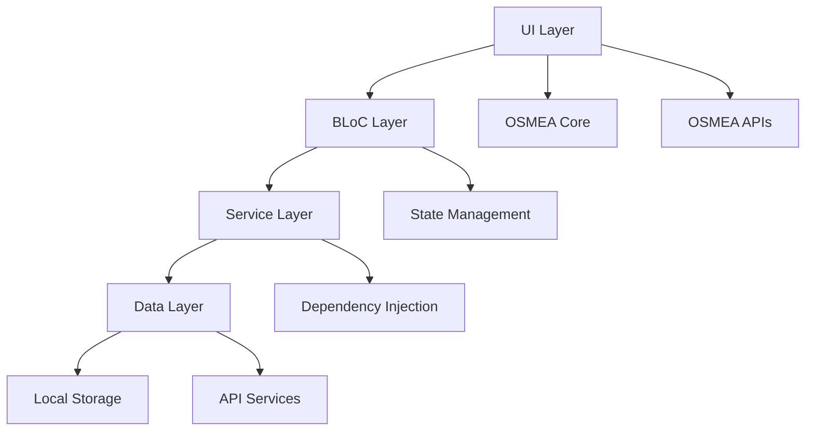

# 🎛️ OSMEA Admin Dashboard

<div align="center">

[](https://github.com/masterfabric-mobile/osmea)
[](pubspec.yaml)
[](https://flutter.dev)
[](../../packages/core)
[](../../packages/apis)

</div>

<div align="center">

**"A Modern E-commerce Admin Dashboard for Managing Products, Orders, and Analytics"**

[🚀 Get Started](#-getting-started) • [📚 Documentation](#-documentation) • [🐛 Report Issues](https://github.com/masterfabric-mobile/osmea/issues) • [💬 Discussions](https://github.com/masterfabric-mobile/osmea/discussions)

</div>

---

## 📋 Table of Contents

- [🌟 Overview](#-overview)
- [✨ Features](#-features)
- [🏗️ Architecture](#️-architecture)
- [🛠️ Technology Stack](#️-technology-stack)
- [🚀 Getting Started](#-getting-started)
- [📱 Screenshots](#-screenshots)
- [🔧 Development](#-development)
- [📚 Documentation](#-documentation)
- [🤝 Contributing](#-contributing)
- [📄 License](#-license)

---

## 🌟 Overview

The **OSMEA Admin Dashboard** is a comprehensive Flutter application designed for e-commerce administrators to manage products, orders, customers, and analytics. Built with modern Flutter architecture and OSMEA packages, it provides a powerful, scalable, and user-friendly interface for business management.

### 🎯 **Project Vision**
> *"To provide a complete admin solution that empowers e-commerce businesses with powerful management tools, real-time analytics, and seamless integration with multiple platforms."*

### 🚀 **Why This Dashboard?**

Managing an e-commerce business requires multiple tools and constant monitoring. This dashboard eliminates complexity by providing:

- **📊 Real-time Analytics** - Live business metrics and performance tracking
- **🛒 Product Management** - Complete product lifecycle management
- **📦 Order Processing** - Streamlined order fulfillment and tracking
- **👥 Customer Management** - Customer insights and relationship management
- **🔧 Multi-platform Integration** - Shopify, WooCommerce, BigCommerce support
- **📱 Responsive Design** - Works on desktop, tablet, and mobile devices

---

## ✨ Features

### 🎛️ **Core Dashboard Features**

| Feature | Description | Status |
|---------|-------------|--------|
| **📊 Analytics Dashboard** | Real-time business metrics and KPIs | ✅ Ready |
| **🛒 Product Management** | Add, edit, delete, and categorize products | ✅ Ready |
| **📦 Order Management** | Process, track, and fulfill orders | ✅ Ready |
| **👥 Customer Management** | Customer profiles and relationship management | ✅ Ready |
| **💰 Revenue Tracking** | Sales reports and financial analytics | ✅ Ready |
| **📈 Performance Metrics** | Business performance and growth tracking | ✅ Ready |

### 🔧 **Administrative Features**

| Feature | Description | Status |
|---------|-------------|--------|
| **🔐 User Authentication** | Secure admin login and session management | ✅ Ready |
| **👤 Role Management** | Multi-level admin access control | ✅ Ready |
| **🌐 Multi-language Support** | Internationalization with slang | ✅ Ready |
| **📱 Responsive Design** | Adaptive layouts for all screen sizes | ✅ Ready |
| **🔔 Notifications** | Real-time alerts and system notifications | ✅ Ready |
| **📊 Data Export** | Export reports and data in multiple formats | ✅ Ready |

### 🛠️ **Technical Features**

| Feature | Description | Status |
|---------|-------------|--------|
| **🏗️ Modular Architecture** | Clean, maintainable code structure | ✅ Ready |
| **🔄 State Management** | BLoC pattern for predictable state | ✅ Ready |
| **💉 Dependency Injection** | Injectable-based service management | ✅ Ready |
| **🌐 API Integration** | RESTful API communication | ✅ Ready |
| **💾 Local Storage** | Offline data persistence | ✅ Ready |
| **🧪 Testing** | Comprehensive test coverage | ✅ Ready |

---

## 🏗️ Architecture

### 📊 **Project Structure**

```
projects/admin_dashboard/
├── 📦 lib/                          # Source code
│   ├── app/                         # Application layer
│   │   ├── routes/                  # Navigation routes
│   │   └── views/                   # UI views and screens
│   │       ├── view_splash/         # Splash screen
│   │       ├── view_onboarding/     # Onboarding flow
│   │       └── view_welcome/        # Welcome screen
│   ├── core/                        # Core utilities
│   │   ├── config/                  # Configuration files
│   │   ├── constants/               # App constants
│   │   └── resources/               # Generated resources
│   ├── flavors/                     # Environment flavors
│   │   ├── main_dev.dart           # Development environment
│   │   └── main_prod.dart          # Production environment
│   └── gen/                         # Generated files
│       ├── assets.gen.dart         # Asset references
│       └── strings.g.dart          # Localization strings
├── 📁 assets/                       # Static assets
│   ├── i18n/                        # Localization files
│   └── images/                      # Image assets
└── 📄 pubspec.yaml                  # Dependencies and configuration
```

### 🔄 **Architecture Pattern**



---

## 🛠️ Technology Stack

### **Core Technologies**
- **Flutter 3.19+** - Latest Flutter framework
- **Dart 3.7+** - Type-safe programming language
- **BLoC Pattern** - State management with flutter_bloc
- **GetIt & Injectable** - Dependency injection and service location

### **OSMEA Packages**
- **OSMEA Core** - Foundation utilities and helpers
- **OSMEA APIs** - Network layer and API integration

### **Additional Dependencies**
- **GoRouter** - Declarative navigation with deep linking
- **Slang** - JSON-based internationalization
- **Flutter Gen** - Strongly typed asset references
- **Flavor** - Environment configuration management

### **Development Tools**
- **Flutter Lints** - Code analysis and linting
- **Build Runner** - Code generation automation
- **Injectable Generator** - DI code generation
- **Slang Build Runner** - Localization code generation

---

## 🚀 Getting Started

### 📋 **Prerequisites**

- **Flutter SDK** (3.19.0 or higher)
- **Dart SDK** (3.7.0 or higher)
- **Git** for version control
- **VS Code** or **Android Studio** for development
- **OSMEA Packages** - Core and APIs packages

### 🔧 **Installation**

#### **1. Clone the Repository**
```bash
git clone https://github.com/masterfabric-mobile/osmea.git
cd osmea/projects/admin_dashboard
```

#### **2. Install Dependencies**
```bash
flutter pub get
```

#### **3. Generate Code**
```bash
# Generate dependency injection code
flutter packages pub run build_runner build --delete-conflicting-outputs

# Generate localization code
flutter packages pub run slang_build_runner build --delete-conflicting-outputs

# Generate asset references
flutter packages pub run flutter_gen_runner
```

#### **4. Run the Application**
```bash
# Development environment
flutter run --flavor dev

# Production environment
flutter run --flavor prod
```

### 🎯 **Quick Start Examples**

#### **Basic App Structure**
```dart
// main_dev.dart
import 'package:flutter/material.dart';
import 'package:admin_dashboard/core/config/config_di.dart';
import 'package:admin_dashboard/starter.dart';

void main() async {
  WidgetsFlutterBinding.ensureInitialized();
  
  // Configure dependency injection
  await configureDependencies();
  
  // Start the app
  runApp(AdminDashboardApp());
}
```

#### **Using OSMEA Packages**
```dart
import 'package:core/core.dart';
import 'package:apis/apis.dart';

class DashboardService {
  final AnalyticsService _analytics = getIt<AnalyticsService>();
  final ShopifyApiService _shopifyApi = getIt<ShopifyApiService>();
  
  Future<void> loadDashboardData() async {
    // Track analytics
    _analytics.trackEvent('dashboard_loaded');
    
    // Load data from API
    final products = await _shopifyApi.getProducts();
    final orders = await _shopifyApi.getOrders();
    
    // Process data
    _processDashboardData(products, orders);
  }
}
```

---

## 📱 Screenshots

### 🎛️ **Dashboard Overview**
- **Analytics Dashboard** - Real-time business metrics
- **Product Management** - Product catalog and inventory
- **Order Processing** - Order fulfillment and tracking
- **Customer Insights** - Customer analytics and profiles

### 📊 **Key Screens**
- **Splash Screen** - App initialization and branding
- **Onboarding Flow** - User setup and configuration
- **Welcome Screen** - Dashboard introduction
- **Main Dashboard** - Core admin functionality

---

## 🔧 Development

### 📦 **Local Development**

#### **Environment Setup**
```bash
# Development environment
flutter run --flavor dev --dart-define=ENVIRONMENT=development

# Production environment
flutter run --flavor prod --dart-define=ENVIRONMENT=production
```

#### **Code Generation**
```bash
# Watch mode for continuous generation
flutter packages pub run build_runner watch --delete-conflicting-outputs

# Generate all code at once
flutter packages pub run build_runner build --delete-conflicting-outputs
```

#### **Testing**
```bash
# Run unit tests
flutter test

# Run integration tests
flutter test integration_test/

# Run with coverage
flutter test --coverage
```

### 📝 **Code Generation**

#### **Dependency Injection**
```bash
# Generate DI code
flutter packages pub run injectable_generator:build
```

#### **Localization**
```bash
# Generate translation code
flutter packages pub run slang_build_runner build
```

#### **Assets**
```bash
# Generate asset references
flutter packages pub run flutter_gen_runner
```

---

## 📚 Documentation

### 📖 **Project Documentation**

- **[📋 Architecture Guide](docs/architecture.md)** - Detailed architecture overview
- **[🔧 Development Guide](docs/development.md)** - Development setup and guidelines
- **[📱 UI/UX Guide](docs/ui-ux.md)** - Design system and component usage
- **[🌐 API Integration](docs/api-integration.md)** - API usage and integration patterns

### 🎓 **Tutorials & Examples**

- **[🚀 Getting Started](docs/getting-started.md)** - Step-by-step setup guide
- **[📊 Dashboard Features](docs/dashboard-features.md)** - Feature usage examples
- **[🔧 Customization](docs/customization.md)** - Customization and theming
- **[🧪 Testing](docs/testing.md)** - Testing strategies and examples

### 🛠️ **Development Resources**

- **[📋 Contributing Guide](../../CONTRIBUTING.md)** - How to contribute
- **[🐛 Issue Tracker](https://github.com/masterfabric-mobile/osmea/issues)** - Report bugs and request features
- **[📄 License](../../LICENSE)** - Project license information

---

## 🤝 Contributing

We welcome contributions! Here's how you can help:

### 🐛 **Reporting Issues**
1. Check existing issues first
2. Create a new issue with detailed information
3. Include steps to reproduce
4. Add screenshots if applicable

### 💡 **Suggesting Features**
1. Open a feature request issue
2. Describe the use case
3. Provide mockups if possible
4. Discuss implementation approach

### 🔧 **Code Contributions**
1. Fork the repository
2. Create a feature branch
3. Make your changes
4. Add tests if applicable
5. Submit a pull request

### 📋 **Contribution Guidelines**
- Follow Dart/Flutter style guidelines
- Write clear commit messages
- Add documentation for new features
- Ensure all tests pass
- Update examples if needed

---

## 📄 License

<div align="center">

> 🔐 **License:** GNU AGPL v3.0  
> 📜 This project is protected under the **GNU Affero General Public License v3.0**.  
> If you modify and deploy this project publicly, you must also **publish your changes** under the same license.

📎 Full details available in the [`LICENSE`](LICENSE) file.

</div>

---

## 🙏 Acknowledgments

- **Flutter Team** - For the amazing framework
- **Dart Team** - For the powerful language
- **OSMEA Team** - For the comprehensive packages
- **E-commerce Community** - For inspiration and feedback
- **Open Source Community** - For continuous support

---

<div align="center">

**Built with ❤️ by the OSMEA Team**

© 2025 MasterFabric Mobile • Maintained by the OSMEA Engineering Team

</div>